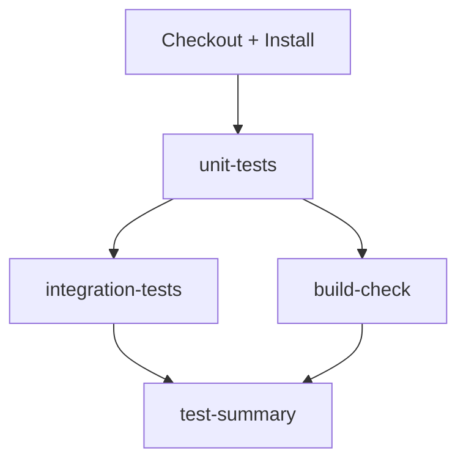

# GitHub Actions 测试配置指南

本文档说明如何在 GitHub Actions 中配置 ShopiFow 的自动化测试。

---

## 测试架构

### 测试分类

```
Root Package (shopiflow)
├── tests/
│   ├── unit/                    # 单元测试（不依赖外部服务）
│   │   ├── lib/prompts.test.ts
│   │   ├── lib/utils.test.ts
│   │   └── n8n-workflow-logic.test.ts
│   └── integration/             # 集成测试（需要 n8n + PostgreSQL）
│       └── n8n-workflows/
│           └── support-handler.test.ts
├── vitest.config.ts             # Vitest 配置（在根目录）
└── package.json                 # 测试脚本定义
```

### GitHub Actions Workflow

`.github/workflows/test.yml` 包含 4 个 jobs：

1. **unit-tests** — Lint + 单元测试（快速，不依赖服务）
2. **integration-tests** — n8n + PostgreSQL + 集成测试（较慢，需要 Docker）
3. **build-check** — Next.js 构建验证 + TypeScript 类型检查
4. **test-summary** — 汇总测试结果

---

## 关键修复（已完成）

### ✅ 修复 1: 移除错误的 `working-directory`

**问题**：
- 原配置在 `apps/frontend` 目录运行测试
- 但 `vitest.config.ts` 和 `tests/` 都在根目录
- 导致找不到配置和测试文件

**修复**：
```yaml
# ❌ 错误（旧版）
- name: Run unit tests
  run: npm run test:run -- tests/unit
  working-directory: apps/frontend  # 错误！

# ✅ 正确（新版）
- name: Run unit tests
  run: npm run test:unit  # 从根目录运行
```

### ✅ 修复 2: 使用正确的测试命令

**根目录 `package.json` 已定义：**
```json
{
  "scripts": {
    "test:unit": "vitest run --config vitest.config.ts tests/unit",
    "test:integration": "vitest run --config vitest.config.ts tests/integration"
  }
}
```

**在 CI 中直接调用：**
```yaml
npm run test:unit        # 单元测试
npm run test:integration # 集成测试
```

### ✅ 修复 3: 真正导入 n8n workflows

**问题**：
- 原 `scripts/import-workflows-test.sh` 只检查文件存在，不实际导入

**修复**：
- 使用 `docker cp` 复制 workflow 文件到容器
- 使用 `docker exec n8n-test n8n import:workflow` 调用 n8n CLI 导入

```bash
docker cp workflow.json n8n-test:/tmp/workflow.json
docker exec n8n-test n8n import:workflow --input=/tmp/workflow.json
```

### ✅ 修复 4: n8n Docker 配置优化

**添加：**
```yaml
--network host  # 简化容器间通信
-e N8N_SKIP_WEBHOOK_DEREGISTRATION_SHUTDOWN=true  # 防止 shutdown 时清空 webhooks
```

---

## 必需的 GitHub Secrets 配置

### 步骤 1: 添加 `OPENROUTER_API_KEY`

集成测试需要调用真实的 OpenRouter API（Claude）来验证 n8n workflow。

**操作步骤：**

1. 访问 [OpenRouter Dashboard](https://openrouter.ai/keys)
2. 创建一个 API Key（建议设置用量限制，如 $5/月）
3. 进入 GitHub 仓库 → **Settings** → **Secrets and variables** → **Actions**
4. 点击 **New repository secret**
5. 填写：
   - **Name**: `OPENROUTER_API_KEY`
   - **Value**: `sk-or-v1-...`（你的 OpenRouter API Key）
6. 点击 **Add secret**

**成本估算：**
- 每次集成测试约调用 2-4 次 AI API
- 每次 ~0.01-0.05 美元
- 每月运行 100 次测试 ≈ $1-5

**安全建议：**
- ✅ 为 CI 创建独立的 API Key，设置严格的用量限制
- ✅ 不要使用生产环境的 API Key
- ✅ 定期轮换 API Key

### 步骤 2: 验证 Secret 配置

推送代码后，查看 GitHub Actions 运行日志：

```bash
git push origin feature_v2
```

在 GitHub 仓库 → **Actions** 标签 → 点击最新的 workflow run → 检查：
- **unit-tests** 应该通过（不需要 API Key）
- **integration-tests** 如果缺少 `OPENROUTER_API_KEY`，会报错：
  ```
  Error: Missing OPENROUTER_API_KEY environment variable
  ```

---

## 本地运行测试（验证）

在推送到 GitHub 之前，建议本地验证：

### 1. 单元测试（最快）

```bash
npm run test:unit
```

**预期输出：**
```
✓ tests/unit/lib/prompts.test.ts (3)
✓ tests/unit/lib/utils.test.ts (2)
✓ tests/unit/n8n-workflow-logic.test.ts (5)

Test Files  3 passed (3)
     Tests  10 passed (10)
```

### 2. 集成测试（需要本地 n8n + PostgreSQL）

```bash
# 启动本地服务
docker-compose up -d

# 等待服务就绪
sleep 10

# 运行集成测试
npm run test:integration
```

**预期输出：**
```
✓ tests/integration/n8n-workflows/support-handler.test.ts (6)
  ✓ 正常分类场景 (2)
  ✓ Draft 分类场景 (2)
  ✓ Manual 分类场景 (2)

Test Files  1 passed (1)
     Tests  6 passed (6)
```

### 3. 完整测试套件

```bash
npm run test:run
```

---

## CI/CD Workflow 执行流程

### 触发条件

```yaml
on:
  push:
    branches: [main, feature_v2, develop]
  pull_request:
    branches: [main, feature_v2]
```

**何时运行：**
- ✅ 推送到 `main` / `feature_v2` / `develop` 分支
- ✅ 创建或更新指向 `main` / `feature_v2` 的 PR

### 执行顺序



**并行执行：**
- `integration-tests` 和 `build-check` 同时运行（依赖 `unit-tests` 完成）

**预计耗时：**
- unit-tests: ~2-3 分钟
- integration-tests: ~5-8 分钟
- build-check: ~3-5 分钟
- **总计**: ~8-10 分钟

---

## 常见问题

### Q1: 集成测试失败 "n8n is not ready"

**原因**: n8n Docker 容器启动慢，health check 超时

**解决**:
- 已在 `test.yml` 中设置 120 秒超时
- 如果仍失败，检查 n8n Docker Hub 是否正常（偶尔拉取镜像慢）

### Q2: workflow 导入失败

**原因**: n8n CLI 导入命令在某些版本可能报错

**解决**:
- 已在 workflow 导入步骤添加 `continue-on-error: true`
- 集成测试会通过 webhook 手动触发，不完全依赖导入

**验证**:
```bash
# 查看 n8n logs
docker logs n8n-test
```

### Q3: 集成测试超时

**原因**: OpenRouter API 调用慢或 rate limit

**解决**:
- 已设置每个测试 `timeout: 60000` (60秒)
- 检查 OpenRouter 账户余额和 rate limits

### Q4: PostgreSQL 连接失败

**原因**: GitHub Actions 的 `services.postgres` 端口映射问题

**解决**:
- 已配置 `ports: - 5433:5432`
- 测试使用 `localhost:5433` 连接
- 添加 health check 确保 PostgreSQL 就绪

### Q5: Coverage 报告为空

**原因**: `coverage/` 路径不正确

**解决**:
- 已修复 `path: coverage/`（根目录）
- `vitest.config.ts` 配置输出到根目录的 `coverage/`

---

## 下一步优化（可选）

### 1. 添加测试覆盖率徽章

在 `README.md` 添加：
```markdown

```

### 2. 缓存 Docker 镜像

加速 n8n 拉取：
```yaml
- name: Cache Docker layers
  uses: actions/cache@v3
  with:
    path: /tmp/.buildx-cache
    key: ${{ runner.os }}-docker-${{ hashFiles('**/Dockerfile') }}
```

### 3. 并行运行集成测试

使用 Vitest 的 `--pool=threads` 和 `--poolOptions.threads.singleThread=false` 加速。

### 4. Mock OpenRouter API（降低成本）

创建 `tests/mocks/openrouter.ts`，在 CI 中 mock AI 调用，只在手动触发时用真实 API。

---

## 监控和维护

### 查看测试历史

GitHub 仓库 → **Actions** → **Test Suite** → 查看所有运行记录

### 测试失败处理

1. 点击失败的 job（如 `integration-tests`）
2. 展开失败的 step
3. 查看日志，特别是：
   - `Print n8n logs on failure` — n8n 容器日志
   - 测试输出中的错误堆栈

### 定期检查

- **每周**: 检查 OpenRouter API 用量（避免超出预算）
- **每月**: 更新 n8n Docker 镜像版本（`n8nio/n8n:latest` 会自动拉取最新）

---

## 完成检查清单

在推送代码前，确认：

- [x] `.github/workflows/test.yml` 已修复（移除 `working-directory`）
- [x] `scripts/import-workflows-test.sh` 已更新（真正导入 workflows）
- [ ] GitHub 仓库已添加 `OPENROUTER_API_KEY` secret
- [ ] 本地运行 `npm run test:unit` 通过
- [ ] 本地运行 `npm run test:integration` 通过（如果有本地环境）
- [ ] 推送到 GitHub 后，在 Actions 标签查看测试结果

---

**配置完成！** 🎉

现在每次推送代码，GitHub Actions 都会自动运行完整测试套件，确保代码质量。
